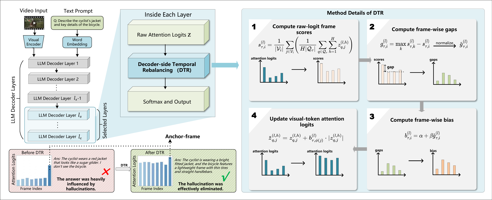

# DTR: Relaxing Anchor-Frame Dominance for Mitigating Hallucinations in Video Large Language Models

Official inference and evaluation code for **DTR** (Decoder-side Temporal Rebalancing), a training-free decoding-time method that mitigates video hallucinations by rebalancing decoder-side temporal evidence in selected decoder layers.


<p align="center">
  
</p>

<p align="center">
  <em>Overview of DTR.</em>
</p>

## Method Overview

DTR works by:
1. computing frame-level scores from decoder attention logits over visual tokens,
2. estimating the relative deficit of each frame with respect to the dominant frame,
3. converting the deficit into a positive frame-wise bias,
4. injecting the bias into visual-token attention logits **before softmax** in selected decoder layers.

This encourages under-attended frames to contribute more during decoding and alleviates anchor-frame dominance.

## Repository Structure

```text
DTR/
├── README.md
├── requirements.txt
├── run_inference_dtr.py
├── eval/
│   ├── eval_predictions.py
│   └── evaluation_utils.py
└── videollava/
    ├── ...
```

## Installation

```bash
conda create -n dtr python=3.10 -y
conda activate dtr

# Install PyTorch according to your CUDA version
pip install torch==2.0.1

# Install dependencies
pip install -r requirements.txt
```

## Dataset Structure

Please organize **VideoHallucer** as follows:

```text
VideoHallucer/
├── object_relation/
│   ├── object_relation.json
│   └── videos/
├── temporal/
│   ├── temporal.json
│   └── videos/
├── semantic_detail/
│   ├── semantic_detail.json
│   └── videos/
├── interaction/
│   ├── interaction.json
│   └── videos/
├── external_factual/
│   ├── external_factual.json
│   └── videos/
├── external_nonfactual/
│   ├── external_nonfactual.json
│   └── videos/
└── fact_detect/
    ├── fact_detect.json
    └── videos/
```

Please download the **Video-LLaVA** checkpoint and the **VideoHallucer** dataset separately, and set their paths with `--model_path` and `--data_dir`.

## Inference

```bash
python run_inference_dtr.py \
    --model_path path/to/video-llava-7b \
    --data_dir path/to/VideoHallucer \
    --output_dir_path outputs/videollava_videohallucer_dtr \
    --alpha 0.5 \
    --beta 0.4 \
    --start_layer 18 \
    --end_layer 31 \
    --skip_existing
```

### Main Arguments

- `--model_path`: path to the Video-LLaVA checkpoint
- `--data_dir`: root directory of VideoHallucer
- `--output_dir_path`: directory for prediction results
- `--device`: GPU device id
- `--alpha`: shared adjustment strength
- `--beta`: deficit compensation strength
- `--start_layer`: starting decoder layer for DTR
- `--end_layer`: ending decoder layer for DTR
- `--skip_existing`: skip subsets whose prediction files already exist

## Evaluation

```bash
python eval/eval_predictions.py \
    --input_dir outputs/videollava_videohallucer_dtr \
    --output_dir eval/results \
    --model_name videollava_dtr
```

## Output

Prediction files are saved under `output_dir_path`, for example:

```text
outputs/videollava_videohallucer_dtr/
├── obj_rel_predictions.json
├── temporal_predictions.json
├── semantic_predictions.json
├── interaction_predictions.json
├── fact_predictions.json
├── nonfact_predictions.json
└── factdet_predictions.json
```

## Citation

If you find this repository useful, please cite:

```bibtex
@article{liu2026relaxing,
  title={Relaxing Anchor-Frame Dominance for Mitigating Hallucinations in Video Large Language Models},
  author={Liu, Zijian and Cao, Sihan and Zheng, Pengcheng and Liu, Kuien and Qin, Caiyan and Qin, Xiaolin and Wei, Jiwei and Zhang, Chaoning},
  journal={arXiv preprint arXiv:2604.12582},
  year={2026}
}
```

## Acknowledgement

This repository builds on Video-LLaVA and uses VideoHallucer for evaluation.
